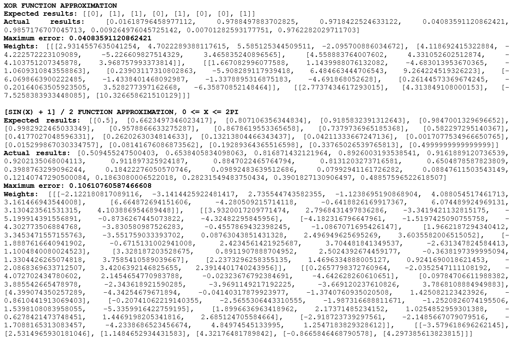

# SimpleNeuralNetwork
Simple constructor of multi-layer neural networks. Sigmoid activation function. Backpropagation.

Despite numerous successful applications of the backpropagation method, it is not a universal solution. Most of all the trouble comes from the too long learning process. In complex tasks, it may take days or even weeks to train the network; it may not even be trained at all.

